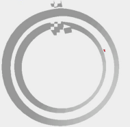

# Reinforcement Leanring for Race Car Game

This project serves as the final project for the "Selected Topics in Reinforcement Learning" course at NYCU, under the instruction of Professor _I-Chen Wu_.

## About the Project
The main goal of this project is to train reinforcement learning (RL) agents to navigate a first-person perspective racing game, with performance evaluated based on the distance covered by the car within a limited time.

## Environment
### Gym Environment
* The environment is modified from [racecar_gym](https://github.com/axelbr/racecar_gym) by course TAs.
* Maps used:
    `Circle_cw` | `Austria`
    :-------------------------:|:-------------------------:
     | 
* Environment Wrapper:
    * Resize
    * Gray Scaling
    * Frame Stack
    * Frame Skip

### Algorithm Environment
Python==3.10  
All algorithms in this project are implemented using 

## Used Algorithms
- Value-based
    * (discrete) Rainbow DQN [1]
- Actor-Critic
    * (discrete + continuous) PPO [2]
    * (continuous) TD3 (Twin Delayed DDPG) [3]

## Result
### Best Result
| |Rainbow DQN|PPO|TD3|
|---|----|---|---|
|Best progress (circle)|1.31|**1.66**|1.17|
|Best progress (austria)|0.29|**2.23**|0.14|  

The performance of PPO consistently placed within the top `15%` of the course.

### Demo

### Visualization
|Patterns|Visualization|
|----|---|
|Turning||
|Heading Left||  
|Heading Right||
## Reference
[1] Hessel, Matteo, et al. "Rainbow: Combining improvements in deep reinforcement learning." Proceedings of the AAAI conference on artificial intelligence. Vol. 32. No. 1. 2018.  
[2] Schulman, John, et al. "Proximal policy optimization algorithms." arXiv preprint arXiv:1707.06347 (2017).  
[3] Fujimoto, Scott, Herke Hoof, and David Meger. "Addressing function approximation error in actor-critic methods." International conference on machine learning. PMLR, 2018.